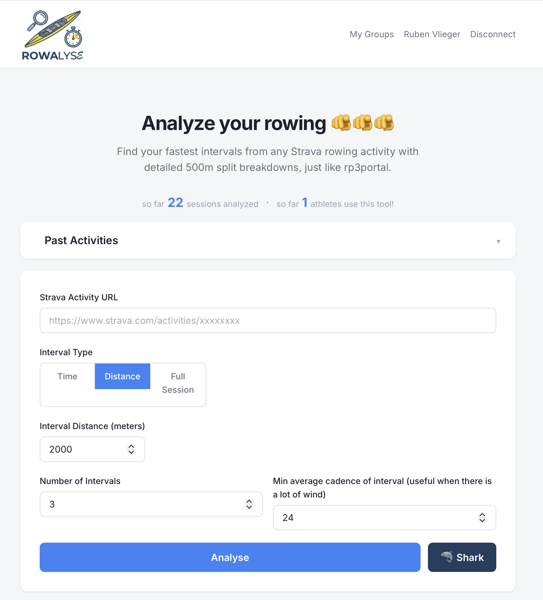
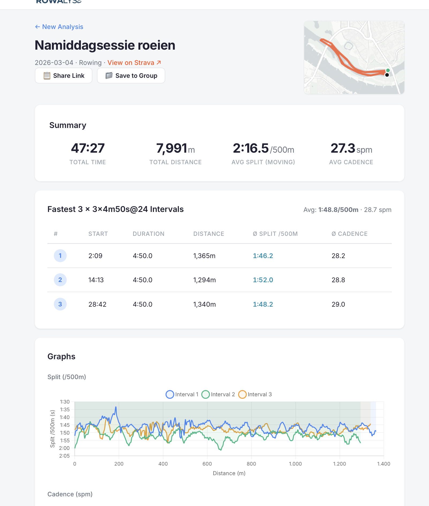

# Rowalyse

**A chill, easy-to-use web tool to analyze your Strava rowing sessions.**

Ever wanted to see your on-the-water splits exactly like you do on the erg (or rp3portal)? Rowalyse takes your Strava activity, finds your fastest intervals, and breaks them down into neat 500m sub-splits with speed, cadence, and heart rate data. 

Built for the rowing community to stop guessing and start knowing exactly where the watts are going.


## Features

*   **Smart Intervals:** Tell it to find your best `4x 5min` or `1x 2000m` pieces, and it'll automatically pull the fastest continuous blocks from your session.
*   **500m Sub-splits:** Every piece is sliced into 500m chunks so you can see if you *actually* kept it steady or just flew and died.
*   **Beautiful Charts:** Clean, interactive graphs for speed, cadence, and heart rate over distance.
*   **Sharkmode 🦈:** A slick bookmarklet that lets you analyze a friend's (or rival's) Strava activity directly from your browser, without needing them to connect their account. 
*   **Wind Context :** Automatically pulls historical wind data (currently tailored only for useage in Nijmegen) so you finally have proof that it was a headwind. 
*   **Playlists / Groups:** Save and group your sessions to easily compare your 2K tests or steady-state pieces over time.
*   **Shareable Links:** Send your coach or crewmates a public link to your analysis. No login required for them.

## Getting Started
Want to run your own instance? It's super straightforward:

### 1. Grab your Strava API keys
1. Go to[strava.com/settings/api](https://www.strava.com/settings/api)
2. Create an application.
3. Set the **Authorization Callback Domain** to `localhost` (or your domain).
4. Grab your `Client ID` and `Client Secret`.

### 2. Set up the environment
Clone the repo and set up your `.env` file:
```bash
git clone https://github.com/RubenVlieger/rowalyze.git
cd rowalyze

# Copy the example env file
cp .env.example .env

# Edit .env and add your Strava keys and a random Flask secret key
nano .env 
```

### 3. Spin it up
```bash
docker compose up -d --build
```
Boom, it's now live at `http://localhost:5000`.



## Wait, what is Sharkmode even?

Sometimes you see a crewmate post a massive session, but they haven't connected to Rowalyse. 
1. Log into Strava.
2. Drag the **🦈 Rowalyse** bookmarklet from the homepage to your bookmarks bar.
3. Go to their activity page on Strava and click the bookmark.
4. It grabs the stream data directly from your browser session and ships it to Rowalyse for a full breakdown. Smooth, right?
And next time you only have to open the bookpage on Strava!
   
## Tech Stack

Keeping it simple and fast:
*   **Backend:** Python, Flask, Gunicorn
*   **Frontend:** Vanilla HTML/CSS/JS (no heavy frameworks, just vibes), Chart.js, Leaflet.js
*   **Database:** SQLite (local, private, and portable)
*   **Weather:** Open-Meteo API for that crucial wind data.

## Privacy first design
Rowalyse stores a hashed, anonymized fragment of your Strava ID just to count users. It doesn't store your passwords, it doesn't track your GPS coordinates (everything is processed in memory), it's just a tool to make boats go faster. 
